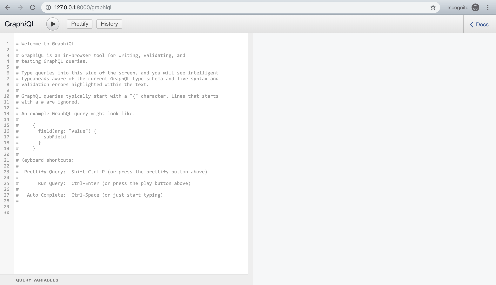

# Huobi-chain 入门

- [Huobi-chain 入门](#huobi-chain-%e5%85%a5%e9%97%a8)
  - [安装和运行](#%e5%ae%89%e8%a3%85%e5%92%8c%e8%bf%90%e8%a1%8c)
    - [安装依赖](#%e5%ae%89%e8%a3%85%e4%be%9d%e8%b5%96)
      - [MacOS](#macos)
      - [ubuntu](#ubuntu)
      - [centos7](#centos7)
      - [archlinux](#archlinux)
    - [直接下载预编译的二进制文件](#%e7%9b%b4%e6%8e%a5%e4%b8%8b%e8%bd%bd%e9%a2%84%e7%bc%96%e8%af%91%e7%9a%84%e4%ba%8c%e8%bf%9b%e5%88%b6%e6%96%87%e4%bb%b6)
    - [从源码编译](#%e4%bb%8e%e6%ba%90%e7%a0%81%e7%bc%96%e8%af%91)
      - [获取源码](#%e8%8e%b7%e5%8f%96%e6%ba%90%e7%a0%81)
      - [安装 rust](#%e5%ae%89%e8%a3%85-rust)
      - [编译](#%e7%bc%96%e8%af%91)
    - [运行单节点](#%e8%bf%90%e8%a1%8c%e5%8d%95%e8%8a%82%e7%82%b9)
    - [运行多节点](#%e8%bf%90%e8%a1%8c%e5%a4%9a%e8%8a%82%e7%82%b9)
  - [与链进行交互](#%e4%b8%8e%e9%93%be%e8%bf%9b%e8%a1%8c%e4%ba%a4%e4%ba%92)
    - [发交易](#%e5%8f%91%e4%ba%a4%e6%98%93)
  - [配置说明](#%e9%85%8d%e7%bd%ae%e8%af%b4%e6%98%8e)

## 安装和运行

### 安装依赖

#### MacOS

```
brew install autoconf libtool
```

#### ubuntu

```
apt update
apt install -y git curl openssl cmake pkg-config libssl-dev gcc build-essential clang libclang-dev
```

#### centos7

```
yum install -y centos-release-scl
yum install -y git make gcc-c++ openssl-devel llvm-toolset-7

# 打开 llvm 支持
scl enable llvm-toolset-7 bash
```

#### archlinux

```
pacman -Sy --noconfirm git gcc pkgconf clang make
```

### 直接下载预编译的二进制文件

我们会通过 [github releases](https://github.com/HuobiGroup/huobi-chain/releases) 发布一些常用操作系统的预编译二进制文件。如果其中包含你的操作系统，可以直接下载对应的文件。

### 从源码编译

#### 获取源码

通过 git 下载源码：

```
git clone https://github.com/HuobiGroup/huobi-chain.git
```

或者在 [github releases](https://github.com/HuobiGroup/huobi-chain/releases) 下载源码压缩包解压。

#### 安装 rust

参考： <https://www.rust-lang.org/tools/install>

```
curl --proto '=https' --tlsv1.2 -sSf https://sh.rustup.rs | sh
```

#### 编译

```
cd /path/to/huobi-chain
make prod
```

编译完成后的二进制文件在 `target/release/huobi-chain`。

### 运行单节点

```
cd /path/to/huobi-chain

# 使用默认配置运行 huobi-chain
# 如果是直接下载的 binary，请自行替换下面的命令为对应的路径
./target/release/huobi-chain

# 查看帮助
$ ./target/release/huobi-chain  -h
Huobi-chain v0.1.0
Muta Dev <muta@nervos.org>

USAGE:
    huobi-chain [OPTIONS]

FLAGS:
    -h, --help       Prints help information
    -V, --version    Prints version information

OPTIONS:
    -c, --config <FILE>     a required file for the configuration [default: ./devtools/chain/config.toml]
    -g, --genesis <FILE>    a required file for the genesis json [default: ./devtools/chain/genesis.json]
```

### 运行多节点

1. 根据节点拓扑，修改配置文件 config.toml，主要注意其中的 privkey、network 和 verifier_list 部分，可以参考下面的 docker-compose 配置，或者详细阅读下文的配置说明；
2. 将 huobi-chain binary 文件、huobi-chain 配置 config.toml 和创世块文件 genesis.json 分发到待部署的节点机器；
3. 启动 bootstrap 节点；
4. 启动其它节点；

## 与链进行交互

链默认在 8000 端口暴露了 GraphQL 接口用于用户与链进行交互。

打开 <http://127.0.0.1:8000/graphiql> 后效果如下图所示：



点击右上角 Docs 可以查阅接口文档。更多 GraphQL 用法可以参阅 [官方文档](https://graphql.org/)。

### 发交易

目前链仅支持原生转账交易。在开发环境可以使用 `sendUnsafeTransferTransaction` 进行转账，示例如下：

```graphql
mutation {
  sendUnsafeTransferTransaction(
    inputRaw: {
      chainId: "0xb6a4d7da21443f5e816e8700eea87610e6d769657d6b8ec73028457bf2ca4036",
      feeCycle: "0xff",
      feeAssetId: "0x0000000000000000000000000000000000000000000000000000000000000000",
      nonce: "0000000000000000000000000000000000000000000000000000000000000000",
      timeout: "0x100"
    },
    inputAction: {
      carryingAmount: "0x01",
      carryingAssetId: "fee0decb4f6a76d402f200b5642a9236ba455c22aa80ef82d69fc70ea5ba20b5",
      receiver: "100000000000000000000000000000000000000000"
    },
    inputPrivkey: "0x45c56be699dca666191ad3446897e0f480da234da896270202514a0e1a587c3f")
}
```

手续费扣除逻辑暂未实现，`feeCycle` 和 `feeAssetId` 可以随意填写。

如想测试转账交易，可以使用创世块中预先分配了原生资产的账号，参考 [此处](../devtools/chain/README.md)。


## 配置说明

默认的配置样例在 `./devtools/chain/config.toml`，此处对其中的一些字段进行说明。

```toml
# chain id，链的唯一标识，同一个链的所有节点该项配置必须相同
chain_id = "b6a4d7da21443f5e816e8700eea87610e6d769657d6b8ec73028457bf2ca4036"  # by sha256(Huobi-chain)

# 节点私钥，节点的唯一标识，在作为 bootstraps 节点时，需要给出地址和该私钥对应的公钥让其他节点连接；如果是出块节点，该私钥对应的地址需要在 consensus verifier_list 中
privkey = "45c56be699dca666191ad3446897e0f480da234da896270202514a0e1a587c3f"

# db config，链数据所在目录
data_path = "./devtools/chain/data"

[graphql]
# graphql 监听地址
listening_address = "0.0.0.0:8000"
# graphql 访问路径
graphql_uri = "/graphql"
# graphiql 路径
graphiql_uri = "/graphiql"

[network]
# p2p 监听地址
listening_address = "0.0.0.0:1337"

[[network.bootstraps]]
# 初始启动时访问的节点信息
pubkey = "031288a6788678c25952eba8693b2f278f66e2187004b64ac09416d07f83f96d5b"
address = "0.0.0.0:1888"

# 交易池相关配置
[mempool]
# 最大超时间隔，如果 当前区块数 + timeout_gap > tx 中的 timeout 字段，则交易池会拒绝接收该交易
timeout_gap = 20
# 交易池大小
pool_size = 20000
# 为了增加性能，每积累到这么多个交易才对外广播一次
broadcast_txs_size = 200
# 交易池广播交易间隔，单位为 毫秒(ms)
broadcast_txs_interval = 200

[consensus]
# 最大 cycles 限制
cycles_limit = 99999999
# cycle 价格
cycles_price = 1
# 出块间隔，单位为 毫秒(ms)
interval = 3000
# 出块节点的地址合集
verifier_list = [ "10f8389d774afdad8755ef8e629e5a154fddc6325a" ]

# 共识相关配置
[consensus.duration]
# 下面两项标识 propose 阶段的超时时间占共识间隔的比例的分子和分母。
# 按照上述配置为 3000ms，则 propose 共识阶段的超时时间为 3000ms * 24 / 30 = 2400ms。
# 下面类似的有 prevote 和 precommit 阶段的超时设置。
propose_numerator = 24
propose_denominator = 30
prevote_numerator = 6
prevote_denominator = 30
precommit_numerator = 6
precommit_denominator = 30

[executor]
# 设为 true 时，节点将只保存最新高度的 state
light = false
```